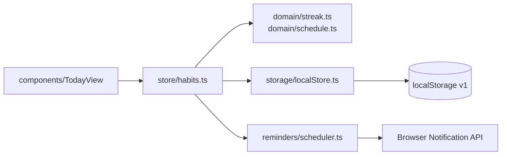
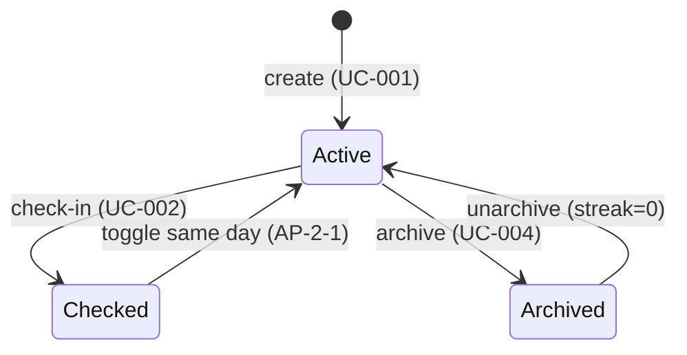

# Design — Habit Log (unified)
## Feature: habit-log | plan_mode: unified
> Version: 1.0 | Status: Approved | Date: 2026-06-30 | Author: Ava (Architect) | Scope: pilot

---

## 1. Architecture Overview

Client-only React SPA. Domain logic (streaks, schedules, dates) is isolated in
pure TypeScript modules with no React or storage imports — the frontend
equivalent of the hexagonal rule: components delegate, `src/domain/` decides.

Layers: `components/` (render + delegate) → `store/` (Zustand actions) →
`domain/` (pure streak/schedule logic) → `storage/` (versioned localStorage port).

## 2. Diagrams

## 3. Data Design (localStorage schema v1)

| Key | Shape | Notes |
|---|---|---|
| `habitlog.v1` | `{ habits: Habit[], completions: Record<habitId, ISODate[]> }` | Single versioned key (FR-002, NFR-003) |

`Habit = { id, name, schedule: 'daily'|'weekdays', reminder?: 'HH:mm', archived: boolean, createdAt }`

## 3.5 NFR Budget Allocation

| NFR | Target | Component | Budget | Verified by |
|---|---|---|---|---|
| NFR-001 | check-in < 100ms | store action + domain recompute | ≤ 20ms | TC-S-002 |
| NFR-001 | check-in < 100ms | localStorage write | ≤ 30ms | |
| NFR-001 | check-in < 100ms | React re-render (today view) | ≤ 50ms | |

## 4. Architecture Decisions

**ADR-001 — Zustand over Redux/Context:** minimal API, no boilerplate, selector
re-renders keep NFR-001's render budget. Accepted.

**ADR-002 — Single versioned localStorage key:** one key + migration function
beats per-habit keys for atomic writes and schema evolution (TH-003, NFR-003). Accepted.

## Approvals

| Role | Status | Date |
|---|---|---|
| Tech Lead | Approved | 2026-06-30 |
| Product Owner | Approved | 2026-06-30 |
