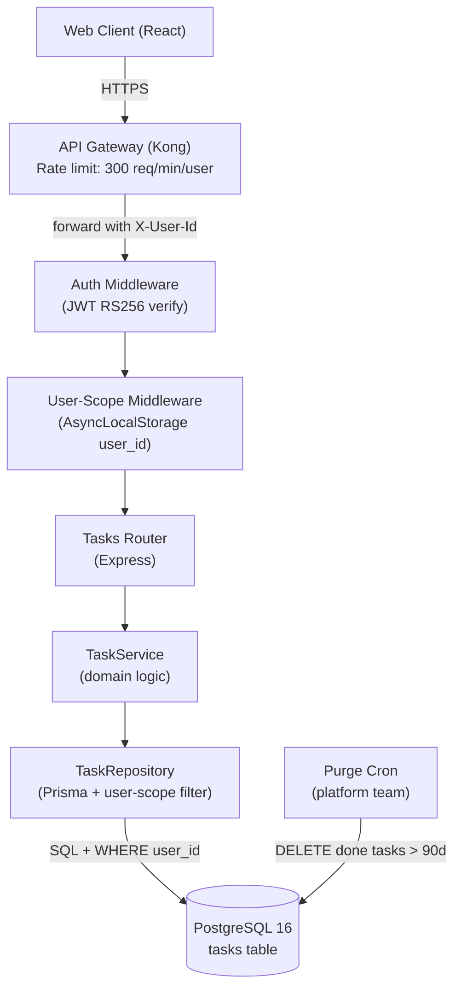
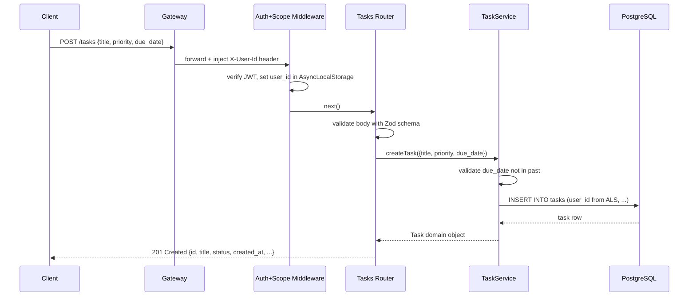
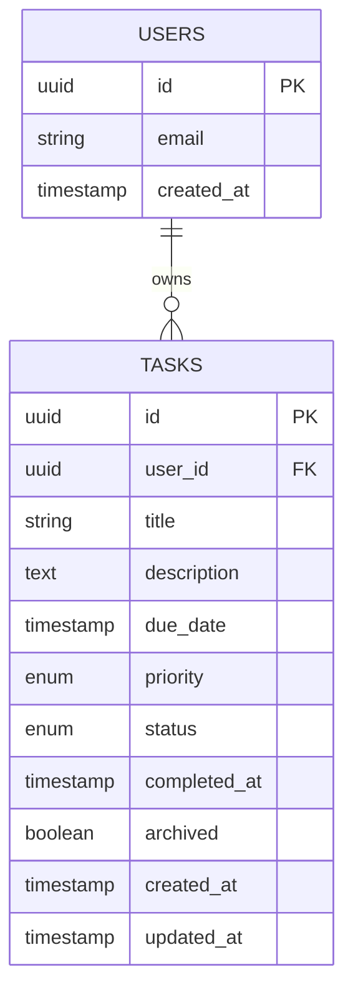

# High Level Design
## Feature: Task Management
## Project: Todo API | Run by: /plan-hld

---

## Component Diagram



---

## Request Flow — POST /tasks



---

## Data Model



---

## API Surface

| Method | Path | Auth | Description |
|---|---|---|---|
| POST | /tasks | JWT | Create task → 201 |
| GET | /tasks | JWT | List own tasks (filtered, paginated) → 200 |
| PATCH | /tasks/:id | JWT | Update task fields → 200 |
| DELETE | /tasks/:id | JWT | Soft-delete task → 204 |

---

## Key Indexes

```sql
-- Primary lookup: user's tasks in reverse chronological order
CREATE INDEX idx_tasks_user_created ON tasks (user_id, created_at DESC)
  WHERE archived = false;

-- Filter by status
CREATE INDEX idx_tasks_user_status ON tasks (user_id, status)
  WHERE archived = false;

-- Purge job
CREATE INDEX idx_tasks_purge ON tasks (status, completed_at)
  WHERE status = 'done' AND archived = false;
```
