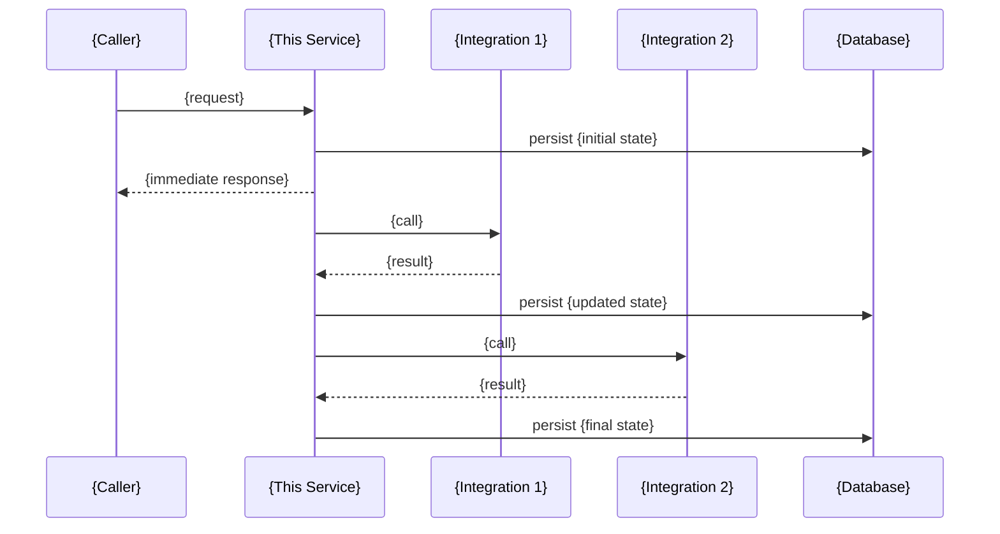

# High Level Design (HLD)
# Feature: {Feature Name}
> Version: 1.0 | Date: {date}

---

## References

| Source | Sections / IDs Used |
|---|---|
| arch.summary.md | {sections/IDs referenced} |
| srd.summary.md | {sections/IDs referenced} |

## 1. System Context (C4 Level 1)
```mermaid
graph TD
    Actor([{Actor / User}])
    Caller[{Upstream Service}]
    ThisService[{This Service}]
    IntA[{Integration A}]
    IntB[{Integration B}]
    DB[({Database})]

    Actor -->|{action}| Caller
    Caller -->|{request}| ThisService
    ThisService -->|{call}| IntA
    ThisService -->|{call}| IntB
    ThisService -->|reads/writes| DB
```

## 2. Container Diagram (C4 Level 2)
```mermaid
graph TD
    subgraph {Environment}
        App[{Service} App]
        DB[({Database})]
        Cache[({Cache})]
        MQ[{Message Broker}]
    end
    Caller -->|{protocol}| App
    App -->|ORM| DB
    App -->|cache| Cache
    App -->|publish/subscribe| MQ
```

## 3. Happy Path Sequence


## 4. Status / State Machine
```mermaid
stateDiagram-v2
    [*] --> {STATE_1}
    {STATE_1} --> {STATE_2}
    {STATE_2} --> {STATE_3}
    {STATE_3} --> {TERMINAL_SUCCESS}
    {STATE_2} --> {TERMINAL_FAILURE}
    {TERMINAL_SUCCESS} --> [*]
    {TERMINAL_FAILURE} --> [*]
```

## 5. Technology Stack

| Layer | Technology | Version |
|---|---|---|
| Language | {from constitution} | {version} |
| Framework | {from constitution} | {version} |
| Database | {from constitution} | {version} |
| Cache | {from constitution} | {version} |
| Messaging | {from constitution} | {version} |
| Deployment | {from constitution} | |

## 6. Key Design Principles

| Principle | Applied As |
|---|---|
| {from constitution core principles} | {how applied} |

## 7. Non-Functional Summary

| Category | Target |
|---|---|
| Response time | {from NFR-NNN} |
| Availability | {from NFR-NNN} |
| Throughput | {from NFR-NNN} |

## 8. Out of Scope
- {item from context out of scope section}

---
*All diagrams: Mermaid — renders in GitHub, VS Code, Claude*

## Approvals

| Role | Status | Date |
|---|---|---|
| {Reviewer — see this command's Review: gate in CLAUDE.md} | Pending | |
