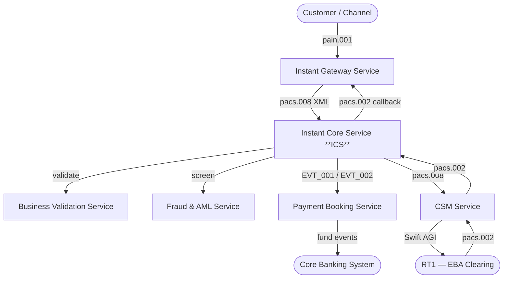
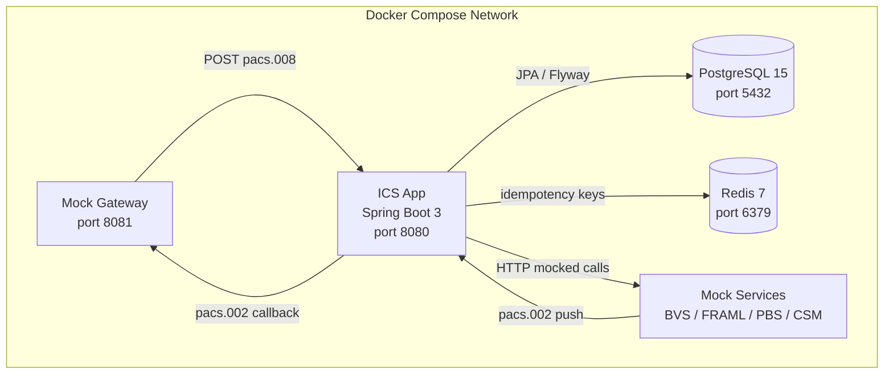
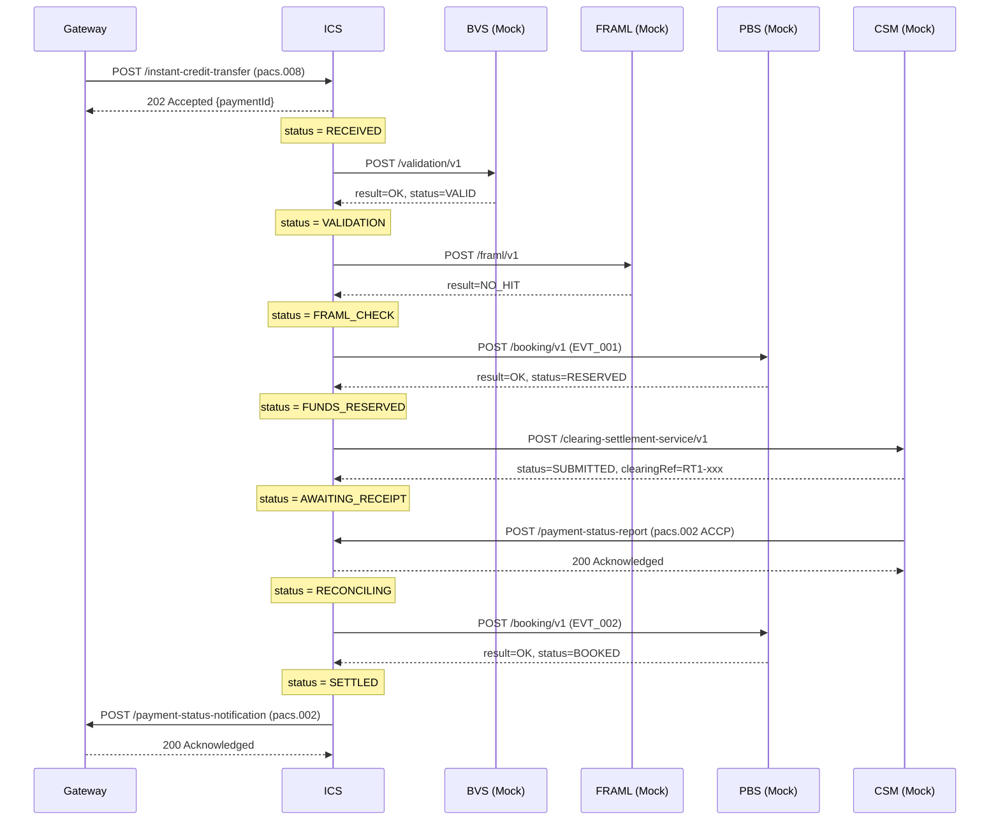
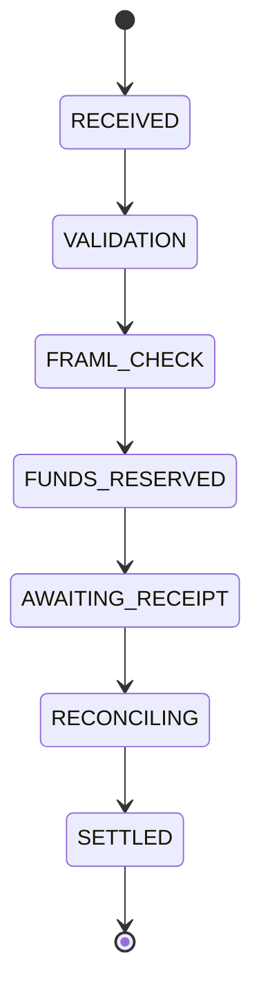

# High Level Design (HLD)
# Instant Core Service (ICS) — Pilot

> Version: 1.0 | Status: Draft | Date: {date}
> Input: arch.summary.md + srd.summary.md

---

## 1. Purpose
{One paragraph — what ICS does, why it exists, pilot scope.}

---

## 2. System Context (C4 Level 1)



> **Pilot:** BVS, FRAML, PBS, CSM, Gateway callback are all mocked.

---

## 3. Container Diagram (C4 Level 2)



---

## 4. Technology Stack

| Layer | Technology | Version |
|---|---|---|
| Language | Java | 21 |
| Framework | Spring Boot | 3.x |
| Build | Maven | 3.9+ |
| Database | PostgreSQL | 15 |
| Cache | Redis | 7 |
| ORM | Spring Data JPA + Hibernate | 6 |
| DB Migration | Flyway | Latest |
| Testing | JUnit 5 + Mockito + Testcontainers | — |
| Containerisation | Docker + Docker Compose | Latest |
| API Style | REST — OpenAPI 3.0 | — |
| Deployment | On-premise | Docker only |

---

## 5. Payment Flow — Happy Path



---

## 6. Payment Status Machine



> Pilot has one terminal status only: SETTLED

---

## 7. Key Design Principles

| Principle | Applied As |
|---|---|
| Hexagonal Architecture | Ports & Adapters — domain isolated from infrastructure |
| Mock-First | All 5 downstream services mocked via @Profile("mock") |
| Persist Before Proceed | Status written to DB before each downstream call |
| Zero PII in Logs | IBAN masked — payment_id + correlation_id only |
| Pilot Simplicity | No retry, no circuit breaker, no compensation |

---

## 8. Non-Functional Summary

| Category | Target |
|---|---|
| End-to-end SLA | 7,000 ms |
| Leg 1 ICS budget | 4,000 ms |
| Availability | 99.99% (production target) |
| Throughput | 500 TPS peak (production target) |
| Data Retention | 7 years (payments) |
| Deployment | Docker Compose — on-premise |

---

## 9. Out of Scope — Pilot

```
Retry / circuit breaker / compensation
Unhappy path handling
Investigation cases
mTLS / HMAC signatures
Inbound payment flow
pacs.004 payment return
Runtime config server
```

---
*Generated from: arch.summary.md + srd.summary.md*
*Diagrams: Mermaid — renders in GitHub, VS Code, and Claude*
