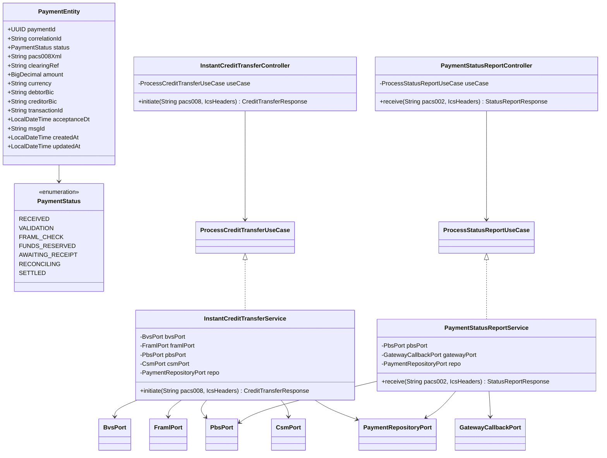
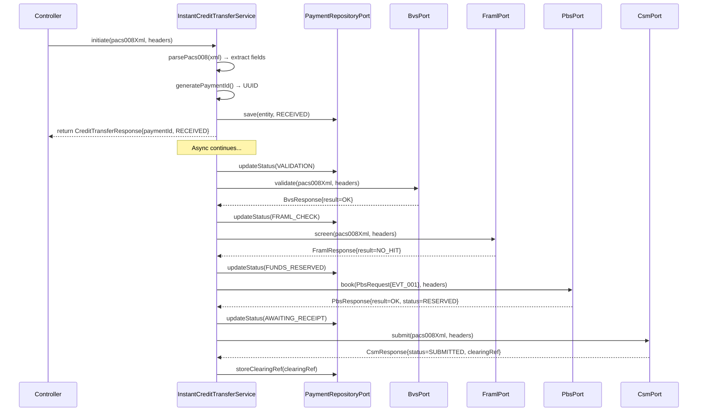
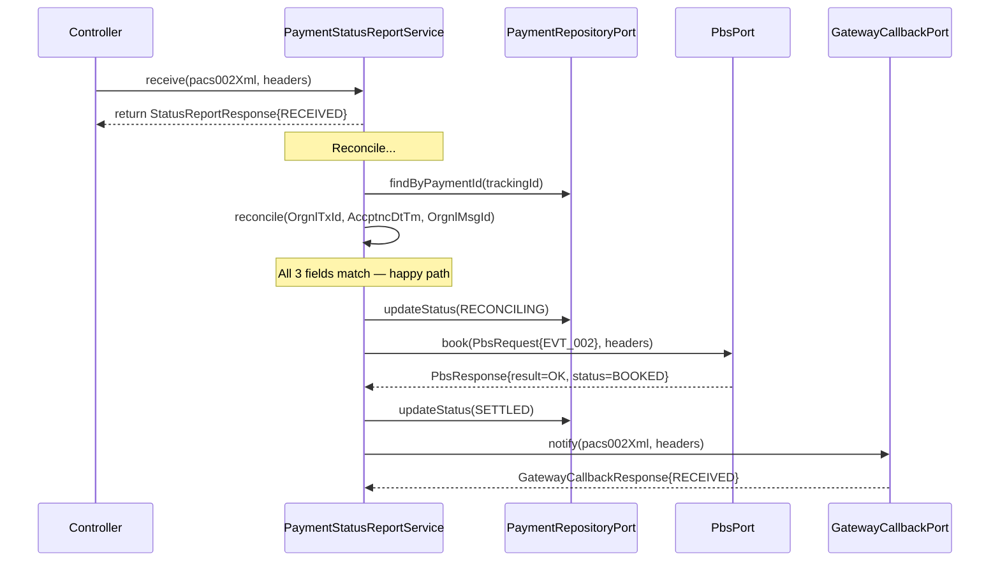
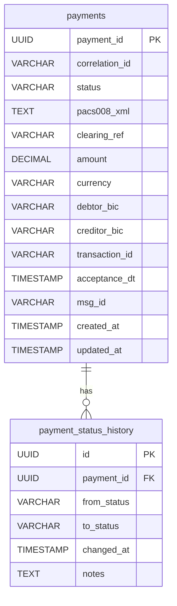

# Low Level Design (LLD)
# Instant Core Service (ICS) — Pilot

> Version: 1.0 | Status: Draft | Date: {date}
> Input: plan.summary.md + data-model.summary.md + api-spec.summary.md

---

## 1. Purpose
Detailed technical design covering class structure, method signatures,
sequence flows, database schema, and configuration for ICS pilot.

---

## 2. Package Structure

```
com.bank.ics/
├── controller/
│   ├── InstantCreditTransferController.java
│   └── PaymentStatusReportController.java
├── service/
│   ├── InstantCreditTransferService.java
│   └── PaymentStatusReportService.java
├── domain/
│   ├── PaymentEntity.java
│   ├── PaymentStatusHistory.java
│   └── PaymentStatus.java (enum)
├── repository/
│   ├── PaymentJpaRepository.java
│   └── PaymentStatusHistoryJpaRepository.java
├── port/
│   ├── in/
│   │   ├── ProcessCreditTransferUseCase.java
│   │   └── ProcessStatusReportUseCase.java
│   └── out/
│       ├── BvsPort.java
│       ├── FramlPort.java
│       ├── PbsPort.java
│       ├── CsmPort.java
│       ├── GatewayCallbackPort.java
│       └── PaymentRepositoryPort.java
├── adapter/
│   └── out/
│       └── JpaPaymentRepositoryAdapter.java
├── mock/
│   ├── MockBvsAdapter.java
│   ├── MockFramlAdapter.java
│   ├── MockPbsAdapter.java
│   ├── MockCsmAdapter.java
│   ├── MockGatewayCallbackAdapter.java
│   └── MockDataFactory.java
├── dto/
│   ├── IcsHeaders.java (record)
│   ├── CreditTransferResponse.java (record)
│   ├── StatusReportResponse.java (record)
│   ├── BvsResponse.java (record)
│   ├── FramlResponse.java (record)
│   ├── PbsRequest.java (record)
│   ├── PbsResponse.java (record)
│   ├── CsmResponse.java (record)
│   └── GatewayCallbackResponse.java (record)
├── config/
│   ├── WebClientConfig.java
│   └── RedisCacheConfig.java
└── exception/
    ├── IcsException.java
    └── GlobalExceptionHandler.java
```

---

## 3. Class Diagram



---

## 4. Sequence Diagram — Leg 1 (Detailed)



---

## 5. Sequence Diagram — Leg 2 (Detailed)



---

## 6. Database Schema



---

## 7. Key Method Signatures

### ProcessCreditTransferUseCase
```java
// ISO 20022: pacs.008.001.08 — FI to FI Customer Credit Transfer
CreditTransferResponse initiate(String pacs008Xml, IcsHeaders headers);
```

### ProcessStatusReportUseCase
```java
// ISO 20022: pacs.002.001.10 — Payment Status Report
StatusReportResponse receive(String pacs002Xml, IcsHeaders headers);
```

### PaymentRepositoryPort
```java
PaymentEntity save(PaymentEntity entity);
Optional<PaymentEntity> findById(UUID paymentId);
void updateStatus(UUID paymentId, PaymentStatus newStatus, String notes);
void storeClearingRef(UUID paymentId, String clearingRef);
```

---

## 8. DTO Records

```java
public record IcsHeaders(
    String correlationId,
    String trackingId,
    String sourceSystem,
    String paymentDirection,
    String messageType,
    String scheme
) {}

public record CreditTransferResponse(
    String paymentId,
    String correlationId,
    String status,
    String timestamp
) {}

public record PbsRequest(
    String payload,
    String messageId,
    String debtorBIC,
    String creditorBIC,
    String currency,
    BigDecimal amount,
    String eventId,
    String creditDebit,
    String typeOfBooking
) {}
```

---

## 9. Configuration

```yaml
# application.yml
spring:
  threads:
    virtual:
      enabled: true
  datasource:
    url: ${DB_URL}
    username: ${DB_USER}
    password: ${DB_PASSWORD}
  flyway:
    enabled: true
  data:
    redis:
      host: ${REDIS_HOST}
      port: ${REDIS_PORT}

app:
  downstream:
    bvs-url: ${BVS_URL}
    framl-url: ${FRAML_URL}
    pbs-url: ${PBS_URL}
    csm-url: ${CSM_URL}
    gateway-callback-url: ${GATEWAY_CALLBACK_URL}
  timeout:
    bvs-ms: 500
    framl-ms: 1000
    pbs-ms: 200
    csm-ms: 6000
    gateway-ms: 3000
  idempotency:
    ttl-hours: 24
```

---

## 10. Error Handling

```java
// Exception hierarchy
IcsException (base)
├── IcsBadRequestException    → HTTP 400 / ICS-400 (missing header)
├── IcsInvalidXmlException    → HTTP 400 / ICS-401 (invalid XML)
└── IcsInternalException      → HTTP 500 / ICS-500 (unexpected error)

// Error response record
public record ErrorResponse(
    String errorCode,
    String message,
    String timestamp,
    String correlationId
) {}
```

---
*Generated from: plan.summary.md + data-model.summary.md + api-spec.summary.md*
*All diagrams: Mermaid — renders in GitHub, VS Code, Claude*
