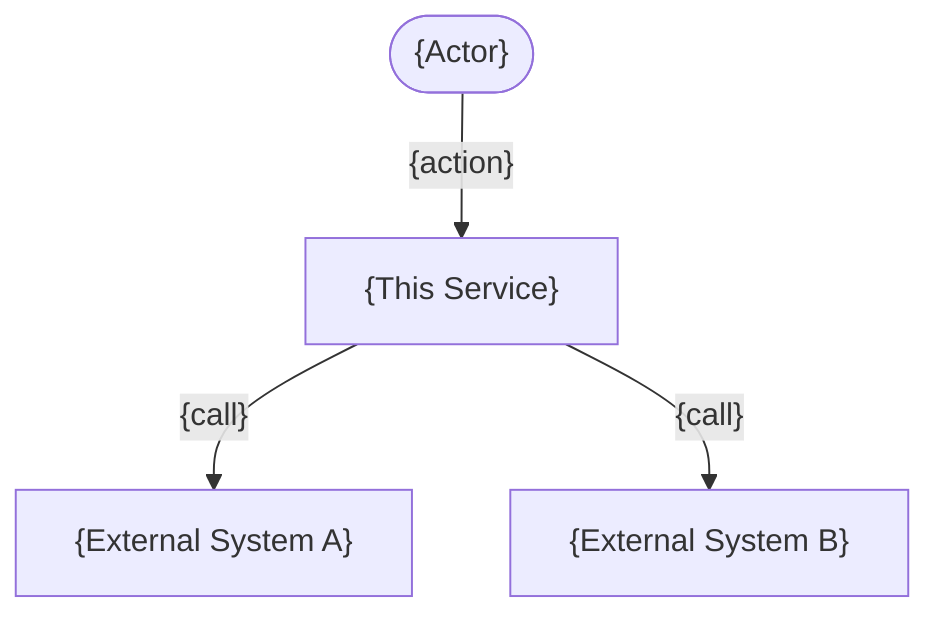
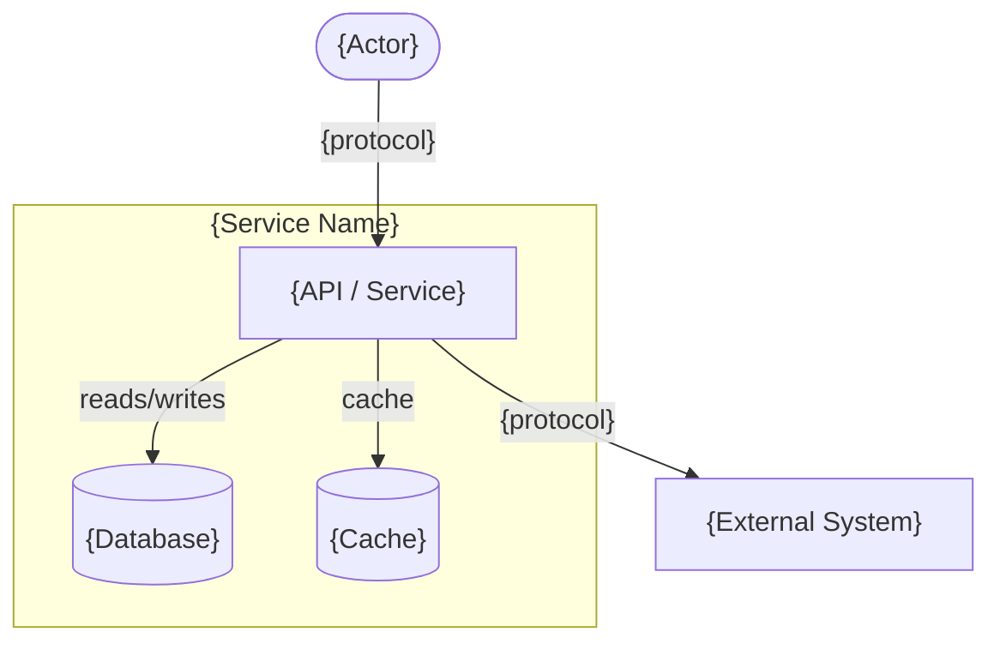
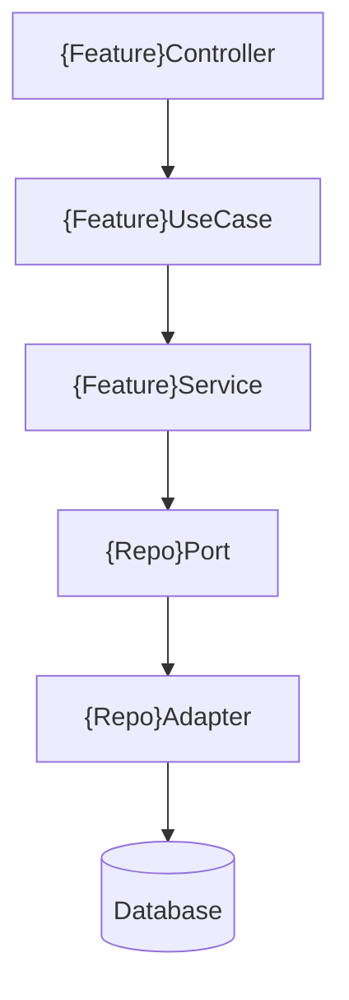
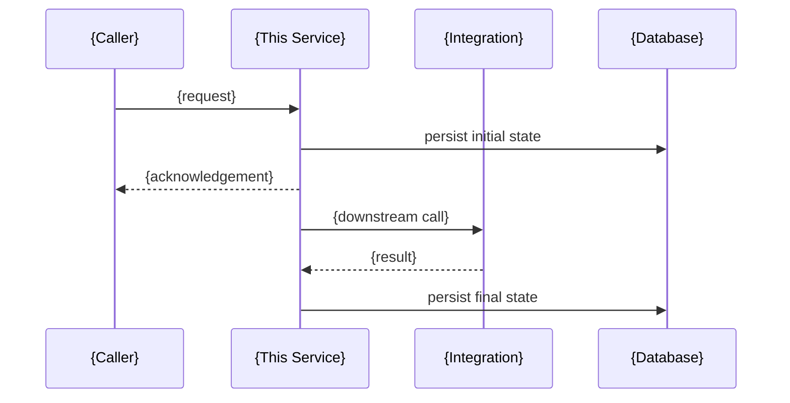
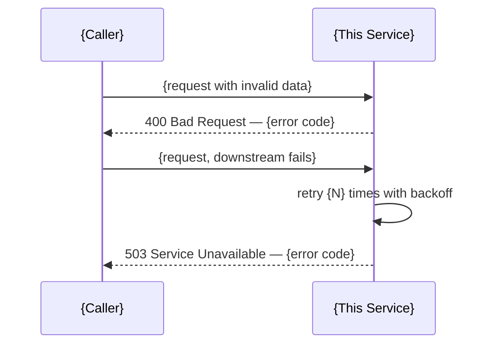

# Design Document
# Feature: {Feature Name}
> Version: 1.0 | Status: Draft | Date: {date} | Author: {author} | Scope: {pilot|mvp|full}

---

## References

| Source | Sections / IDs Used |
|---|---|
| use-cases.summary.md | {UC-NNN flows, AP/EP paths — inform sequence diagrams} |
| srd.summary.md | {FR-NNN, NFR-NNN applied} |
| clarify.summary.md | {resolved items applied} |
| analyze.summary.md | {risk mitigations / NFR mapping applied} |

---

## 1. Architecture Overview

### 1.1 Architecture Pattern
{Chosen pattern: e.g. Hexagonal / Layered / Event-Driven / CQRS / Microservices}
{One paragraph — why this pattern for this feature, what constraints drove it}

### 1.2 System Layers

| Layer | Package / Path | Responsibility |
|---|---|---|
| {e.g. Controller} | {e.g. controller/} | {responsibility} |
| {e.g. Use Case} | {e.g. port/in/} | {responsibility} |
| {e.g. Service} | {e.g. service/} | {responsibility} |
| {e.g. Adapter} | {e.g. adapter/out/} | {responsibility} |
| {e.g. Domain} | {e.g. domain/} | {responsibility} |

### 1.3 Key Design Decisions

| ID | Decision | Rationale |
|---|---|---|
| DEC-{NNN} | {decision} | {why} |
| DEC-{NNN} | {decision} | {why} |

### 1.4 NFR → Architecture Mapping

| NFR-NNN | Requirement | Design Constraint Applied |
|---|---|---|
| NFR-{NNN} | {requirement} | {what design decision satisfies it} |

### 1.5 Cross-Cutting Concerns

| Concern | Approach |
|---|---|
| Authentication | {from constitution} |
| Authorisation | {from constitution} |
| Logging | Structured JSON + trace ID on every line |
| Error Handling | Global handler + structured error envelope |
| Idempotency | {approach if applicable} |
| Observability | {metrics / tracing approach} |

---

## 2. Diagrams

### 2.1 System Context (C4 L1)


### 2.2 Container Diagram (C4 L2)


### 2.3 Component Diagram (C4 L3)


### 2.4 Happy Path Sequence


### 2.5 Error / Failure Paths


### 2.6 State Machine (if applicable)
```mermaid
stateDiagram-v2
    [*] --> {STATE_1}
    {STATE_1} --> {STATE_2} : {trigger}
    {STATE_2} --> {STATE_SUCCESS} : {trigger}
    {STATE_2} --> {STATE_FAILURE} : {trigger}
    {STATE_SUCCESS} --> [*]
    {STATE_FAILURE} --> [*]
```

---

## 3. API Design

> {Skip this section for project types with no external API: iac, desktop-local, library (replace with Public Library API section)}

**If this service provides the API** (backend-service, fullstack backend):
the full API surface is a living document at `.specify/service/api-spec.md`
— this section is never the full API design, only this feature's
contribution to it:

```
This feature's API surface — see `.specify/service/api-spec.md` for the
full, current API (version {N}).

New in this feature:
- {METHOD} {path} — {1-line purpose}

Changed in this feature:
- {METHOD} {path} — {1-line description of the change}

(none, if this feature adds no new/changed endpoints)
```

**If this component only *consumes* an API** (frontend-spa, mobile —
consumer view): write the full contract this feature calls directly here,
per-feature, as this isn't something the component itself owns:

### 3.1 API Style & Conventions

| Property | Value |
|---|---|
| Style | {REST / GraphQL / gRPC / AsyncAPI — from constitution} |
| Base URL | `{protocol}://{host}/api/v{version}` |
| Auth | {Bearer JWT / API Key / mTLS — from constitution} |
| Versioning | {URL path / header — approach} |
| Idempotency | `Idempotency-Key` header required on all mutations |
| Correlation | `X-Correlation-Id` (UUID v4) required on all requests |
| Content-Type | `application/json` |

### 3.2 Endpoints Consumed

#### {METHOD} /api/v{N}/{resource}
**Purpose:** {what this creates, retrieves, or triggers}
**Auth:** required / none
**Traceability:** FR-NNN, UC-NNN

**Request:**
```json
{
  "{field}": "{type} — {description}"
}
```

**Response {2xx}:**
```json
{
  "{field}": "{type} — {description}"
}
```

**Error responses:**
| HTTP | Error Code | When |
|---|---|---|
| 400 | VALIDATION_ERROR | {condition} |
| 401 | UNAUTHORIZED | {condition} |
| 404 | NOT_FOUND | {condition} |
| 409 | DUPLICATE_REQUEST | Duplicate Idempotency-Key |
| 500 | INTERNAL_ERROR | Unexpected failure |

{Repeat block per endpoint}

### 3.3 NFR Budget Allocation

> Every measurable NFR target from srd.md is split across the components on
> its critical path — so "P99 ≤ 500ms" becomes budgets a developer can test
> against, not a hope. Budgets must sum to ≤ the NFR target.

| NFR-NNN | Target | Component / hop | Budget | Verified by |
|---|---|---|---|---|
| NFR-{NNN} | {e.g. P99 ≤ 500ms} | {e.g. gateway → service} | {e.g. ≤ 50ms} | {PERF-NNN / TC-NNN} |
| NFR-{NNN} | {same target} | {e.g. service logic} | {e.g. ≤ 150ms} | |
| NFR-{NNN} | {same target} | {e.g. DB query} | {e.g. ≤ 200ms} | |

---

## 4. Architecture Decisions (ADR)

> One ADR block per key decision. Pilot: minimum 2 ADRs for the most critical decisions. MVP+: one ADR per DEC-NNN from §1.3.

### ADR-{NNN} — {Decision Title}
**Status:** Accepted
**Date:** {date}

**Context:**
{What situation required this decision? What forces were at play?}

**Decision:**
{What was decided — one clear statement.}

**Rationale:**
{Why this option over the alternatives.}

**Alternatives Considered:**
- **{Option A}:** rejected because {reason}
- **{Option B}:** rejected because {reason}

**Consequences:**
- Positive: {benefit}
- Negative: {tradeoff}
- Risk: {risk + mitigation}

**Review Date:** {when to revisit — e.g. "After pilot launch"}

---

{Repeat ADR block per key decision}

---

## Approvals

| Role | Approver | Status | Date |
|---|---|---|---|
| Architect | | Pending | |
| Tech Lead | | Pending | |
| Stakeholder (HLD sign-off) | | Pending | |

## Version History

| Version | Date | Changed By | Summary of Changes | CHG-NNN |
|---|---|---|---|---|
| 1.0 | {date} | {author} | Initial draft | — |
