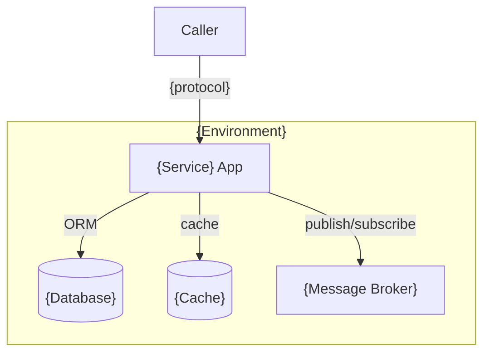
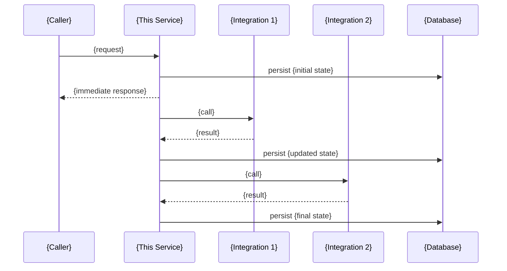
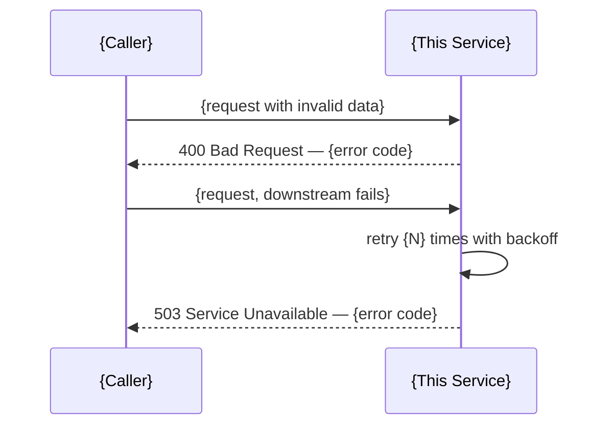

# High Level Design (HLD)
# Feature: {Feature Name}
> Version: 1.0 | Status: Draft | Date: {date} | Author: {author}

---

## References
| Source | Sections / IDs Used |
|---|---|
| arch.summary.md | {sections/IDs referenced} |
| use-cases.summary.md | {UC-NNN flows used in sequence diagram} |
| srd.summary.md | {NFR-NNN targets used in Section 6} |

## 1. System Context (C4 Level 1)


## 2. Container Diagram (C4 Level 2)


## 3. Happy Path Sequence


## 4. Error / Failure Paths


## 5. State Machine
> Include if this feature has stateful entities (orders, payments, bookings, etc.).
> If no stateful entity exists, replace this section with: "No state machine — this feature has no stateful entity."

```mermaid
stateDiagram-v2
    [*] --> {STATE_1}
    {STATE_1} --> {STATE_2} : {trigger}
    {STATE_2} --> {STATE_3} : {trigger}
    {STATE_3} --> {TERMINAL_SUCCESS} : {trigger}
    {STATE_2} --> {TERMINAL_FAILURE} : {error}
    {TERMINAL_SUCCESS} --> [*]
    {TERMINAL_FAILURE} --> [*]
```

## 6. API Design

> {Skip this section for project types with no external API: iac, desktop-local, library (replace with Public Library API section)}

**If this service provides the API** (backend-service, fullstack backend):
the full API surface is a living document at `.specify/service/api-spec.md`
— this section is never the full API design, only this feature's
contribution to it:

```
This feature's API surface — see `.specify/service/api-spec.md` for the
full, current API (version {N}).

New in this feature:
- {METHOD} {path} — {1-line purpose}

Changed in this feature:
- {METHOD} {path} — {1-line description of the change}

(none, if this feature adds no new/changed endpoints)
```

**If this component only *consumes* an API** (frontend-spa, mobile —
consumer view): write the full contract this feature calls directly here,
per-feature, as this isn't something the component itself owns:

### 6.1 API Style & Conventions

| Property | Value |
|---|---|
| Style | {REST / GraphQL / gRPC / AsyncAPI — from constitution} |
| Base URL | `{protocol}://{host}/api/v{version}` |
| Auth | {Bearer JWT / API Key / mTLS — from constitution} |
| Versioning | {URL path / header — approach} |
| Idempotency | `Idempotency-Key` header required on all mutations |
| Correlation | `X-Correlation-Id` (UUID v4) required on all requests |
| Content-Type | `application/json` |

### 6.2 Endpoints Consumed

#### {METHOD} /api/v{N}/{resource}
**Purpose:** {what this creates, retrieves, or triggers}
**Auth:** required / none
**Traceability:** FR-NNN, UC-NNN

**Request:**
```json
{
  "{field}": "{type} — {description}"
}
```

**Response {2xx}:**
```json
{
  "{field}": "{type} — {description}"
}
```

**Error responses:**
| HTTP | Error Code | When |
|---|---|---|
| 400 | VALIDATION_ERROR | {condition} |
| 401 | UNAUTHORIZED | {condition} |
| 404 | NOT_FOUND | {condition} |
| 409 | DUPLICATE_REQUEST | Duplicate Idempotency-Key |
| 500 | INTERNAL_ERROR | Unexpected failure |

{Repeat block per endpoint}

### 6.3 NFR Budget Allocation

> Every measurable NFR target from srd.md is split across the components on
> its critical path — so "P99 ≤ 500ms" becomes budgets a developer can test
> against, not a hope. Budgets must sum to ≤ the NFR target.

| NFR-NNN | Target | Component / hop | Budget | Verified by |
|---|---|---|---|---|
| NFR-{NNN} | {e.g. P99 ≤ 500ms} | {e.g. gateway → service} | {e.g. ≤ 50ms} | {PERF-NNN / TC-NNN} |
| NFR-{NNN} | {same target} | {e.g. service logic} | {e.g. ≤ 150ms} | |
| NFR-{NNN} | {same target} | {e.g. DB query} | {e.g. ≤ 200ms} | |

## 7. Technology Stack
| Layer | Technology | Version |
|---|---|---|
| Language | {from constitution Part 2} | {version} |
| Framework | {from constitution Part 2} | {version} |
| Database | {from constitution Part 2} | {version} |
| Cache | {from constitution Part 2} | {version} |
| Messaging | {from constitution Part 2} | {version} |
| Deployment | {from constitution Part 2} | |

## 8. NFR Summary
> Component budget: split the target across the critical-path components
> from §2/§3 so each has a testable share. Budgets sum to ≤ the target.
> Skip this section entirely if this project type only consumes an API
> (frontend-spa, mobile) and already covered NFR budgets in §6.3 above.

| NFR-NNN | Category | Target | Component budget allocation |
|---|---|---|---|
| NFR-{NNN} | Response time | {measurable target from srd.summary.md} | {e.g. gateway ≤ 50ms · service ≤ 150ms · DB ≤ 200ms} |
| NFR-{NNN} | Availability | {e.g. 99.9% uptime} | {e.g. per-dependency uptime floor} |
| NFR-{NNN} | Throughput | {e.g. 100 TPS} | {e.g. worker pool sizing / partition count} |

---
*All diagrams: Mermaid — renders in GitHub, VS Code, Claude. Paste into https://mermaid.live to verify before approving.*

## Approvals
| Role | Approver | Status | Date |
|---|---|---|---|
| Architect | | Pending | |
| Tech Lead | | Pending | |

## Version History
| Version | Date | Changed By | Summary | CHG-NNN |
|---|---|---|---|---|
| 1.0 | {date} | {author} | Initial draft | — |
