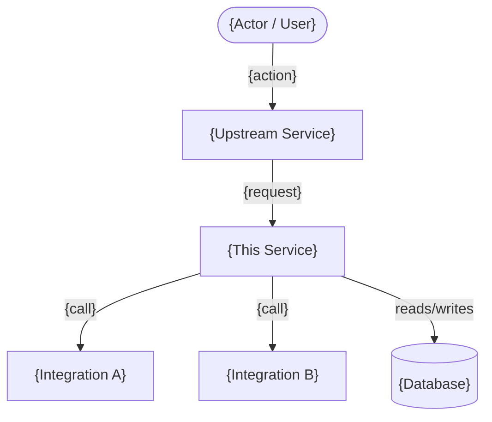
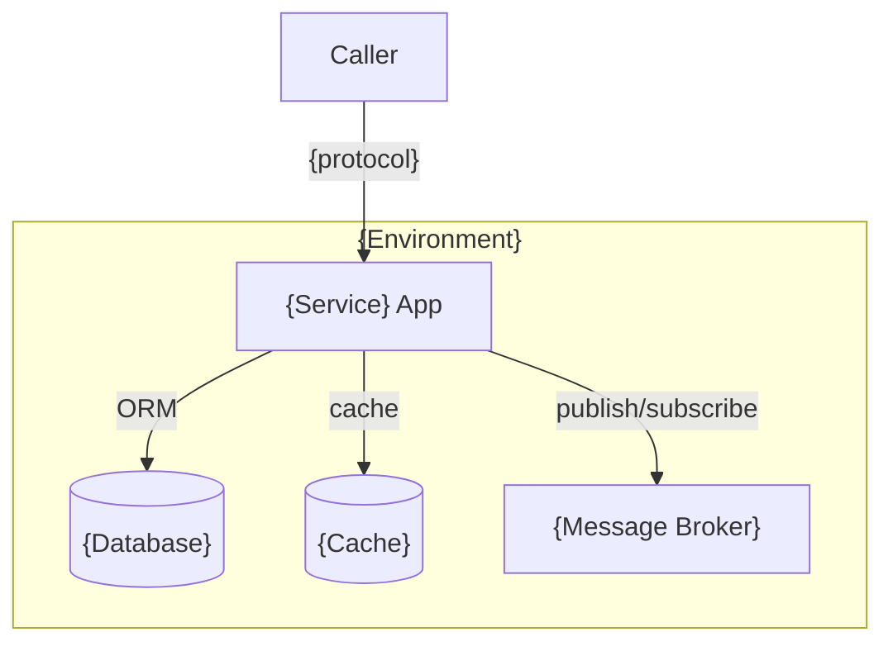
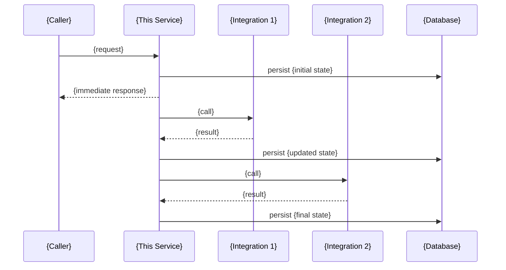

# High Level Design (HLD)
# Feature: {Feature Name}
> Version: 1.0 | Status: Draft | Date: {date} | Author: {author}

---

## References
| Source | Sections / IDs Used |
|---|---|
| arch.summary.md | {sections/IDs referenced} |
| use-cases.summary.md | {UC-NNN flows used in sequence diagram} |
| srd.summary.md | {NFR-NNN targets used in Section 6} |

## 1. System Context (C4 Level 1)


## 2. Container Diagram (C4 Level 2)


## 3. Happy Path Sequence


## 4. State Machine
> Include if this feature has stateful entities (orders, payments, bookings, etc.).
> If no stateful entity exists, replace this section with: "No state machine — this feature has no stateful entity."

```mermaid
stateDiagram-v2
    [*] --> {STATE_1}
    {STATE_1} --> {STATE_2} : {trigger}
    {STATE_2} --> {STATE_3} : {trigger}
    {STATE_3} --> {TERMINAL_SUCCESS} : {trigger}
    {STATE_2} --> {TERMINAL_FAILURE} : {error}
    {TERMINAL_SUCCESS} --> [*]
    {TERMINAL_FAILURE} --> [*]
```

## 5. Technology Stack
| Layer | Technology | Version |
|---|---|---|
| Language | {from constitution Part 2} | {version} |
| Framework | {from constitution Part 2} | {version} |
| Database | {from constitution Part 2} | {version} |
| Cache | {from constitution Part 2} | {version} |
| Messaging | {from constitution Part 2} | {version} |
| Deployment | {from constitution Part 2} | |

## 6. NFR Summary
| NFR-NNN | Category | Target |
|---|---|---|
| NFR-{NNN} | Response time | {measurable target from srd.summary.md} |
| NFR-{NNN} | Availability | {e.g. 99.9% uptime} |
| NFR-{NNN} | Throughput | {e.g. 100 TPS} |

---
*All diagrams: Mermaid — renders in GitHub, VS Code, Claude. Paste into https://mermaid.live to verify before approving.*

## Approvals
| Role | Status | Date |
|---|---|---|
| Architect | Pending | |
| Tech Lead | Pending | |

## Version History
| Version | Date | Changed By | Summary | CHG-NNN |
|---|---|---|---|---|
| 1.0 | {date} | {author} | Initial draft | — |
