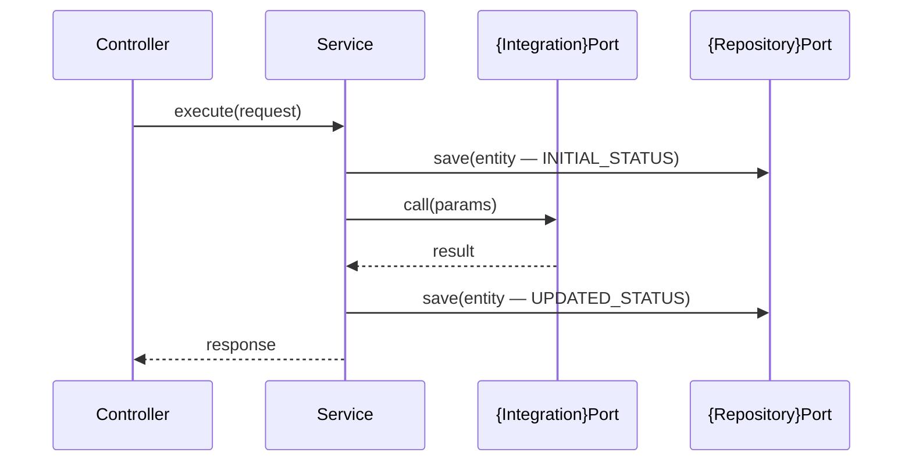

# Low Level Design (LLD)
# Feature: {Feature Name}
> Version: 1.0 | Date: {date}

---

## References
| Source | Sections / IDs Used |
|---|---|
| design.summary.md | {architecture pattern, layers, API design applied} |

## 1. Package Structure

> **Note:** The structure below uses Java/Spring conventions as the reference example.
> Adapt to your tech stack (Python: `src/{pkg}/`, TypeScript: `src/`, Go: `internal/{pkg}/`,
> React: `src/components/{feature}/`) using the same layering intent from constitution Part 2.

```
src/main/java/com/{org}/{service}/
├── controller/
│   └── {Feature}Controller.java
├── port/
│   ├── in/
│   │   └── {Feature}UseCase.java        (interface)
│   └── out/
│       ├── {Integration}Port.java       (interface)
│       └── {Repository}Port.java        (interface)
├── service/
│   └── {Feature}Service.java
├── domain/
│   ├── {Entity}.java                    (record or class)
│   └── {EntityStatus}.java              (enum)
├── dto/
│   ├── {Feature}Request.java            (record)
│   └── {Feature}Response.java           (record)
├── adapter/
│   ├── in/
│   │   └── (controller is here)
│   └── out/
│       ├── {Integration}Adapter.java    @Profile("prod")
│       └── Jpa{Entity}Adapter.java
├── mock/
│   └── Mock{Integration}Adapter.java   @Profile("mock")
└── config/
    └── {Feature}Config.java
```

## 2. Class Diagram
```mermaid
classDiagram
    class {Feature}Controller {
        -{Feature}UseCase useCase
        +handle{Feature}({Feature}Request) {Feature}Response
    }
    class {Feature}UseCase {
        <<interface>>
        +execute({Feature}Request) {Feature}Response
    }
    class {Feature}Service {
        -{Integration}Port integrationPort
        -{Repository}Port repositoryPort
        +execute({Feature}Request) {Feature}Response
    }
    class {Integration}Port {
        <<interface>>
        +call({param}) {Result}
    }
    class {Repository}Port {
        <<interface>>
        +save({Entity}) {Entity}
        +findById(UUID) Optional~{Entity}~
    }

    {Feature}Controller --> {Feature}UseCase
    {Feature}Service ..|> {Feature}UseCase
    {Feature}Service --> {Integration}Port
    {Feature}Service --> {Repository}Port
```

## 3. Key Sequence — Happy Path


## 4. Key Classes

### {Feature}Controller
```java
@RestController
@RequestMapping("/api/v1/{resource}")
@RequiredArgsConstructor
@Slf4j
public class {Feature}Controller {
    private final {Feature}UseCase useCase;

    @PostMapping
    @ResponseStatus(HttpStatus.ACCEPTED)
    public {Feature}Response handle(@RequestBody @Valid {Feature}Request request,
                                    @RequestHeader("X-Correlation-Id") String correlationId) {
        log.info("{feature} received correlationId={}", correlationId);
        return useCase.execute(request);
    }
}
```

### {Feature}Service
```java
@Service
@RequiredArgsConstructor
@Slf4j
public class {Feature}Service implements {Feature}UseCase {
    private final {Integration}Port integrationPort;
    private final {Repository}Port repositoryPort;

    @Override
    @Transactional
    public {Feature}Response execute({Feature}Request request) {
        var entity = {Entity}.from(request);
        repositoryPort.save(entity);
        var result = integrationPort.call(entity);
        entity = entity.with{Status}({Status}.PROCESSED, result);
        repositoryPort.save(entity);
        return {Feature}Response.from(entity);
    }
}
```

### DTOs (Records)
```java
public record {Feature}Request(
    @NotNull UUID id,
    @NotNull @DecimalMin("0.01") BigDecimal amount,
    @NotNull @Size(min=3, max=3) String currency
) {}

public record {Feature}Response(
    UUID {resourceId},
    String status,
    Instant receivedAt
) {}
```

## 5. Test Classes
| Test Class | Tests | Type |
|---|---|---|
| {Feature}ControllerTest | happy path + validation errors | Unit |
| {Feature}ServiceTest | happy path + unhappy paths | Unit |
| Mock{Integration}AdapterTest | mock returns correct result | Unit |
| {Feature}IntegrationTest | full HTTP → DB | Integration |

## 6. Key Method Signatures
| Class | Method | Returns |
|---|---|---|
| {Feature}UseCase | execute({Feature}Request) | {Feature}Response |
| {Integration}Port | call({params}) | {Result} |
| {Repository}Port | save({Entity}) | {Entity} |
| {Repository}Port | findById(UUID) | Optional<{Entity}> |

---

## Approvals
| Role | Status | Date |
|---|---|---|
| {Reviewer — see this command's Review: gate in CLAUDE.md} | Pending | |
