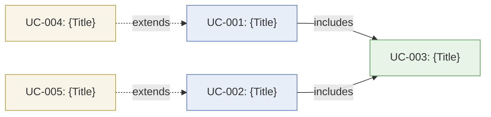

# Use Case Specification — {Feature Name}
Feature: {manifest.project.feature}
Version: v1.0 | Date: {date}
Status: DRAFT

> **Inference Marker:** Steps or paths not explicitly stated in `context.md` but derived by the agent are marked `[INFERRED: {basis}]`.
> The Business Analyst reviews every `[INFERRED]` marker and either: confirms it (remove the marker), corrects it (update the step), or escalates it as a `[NEEDS CLARIFICATION]`.
> Confirmed steps carry no marker. Only inferred content is flagged.

---

## §1 Actor Registry

| Actor ID | Name | Type | Description |
|---|---|---|---|
| ACT-{NNN} | {Primary User} | Primary | Human actor who initiates the main flow |
| ACT-{NNN} | {External System} | System | External automated system or service |
| ACT-{NNN} | {Administrator} | Secondary | Human actor with administrative privileges |

**Actor Types:**
- **Primary** — initiates the use case (has a goal to achieve)
- **Secondary** — participates or is notified, does not initiate
- **System** — automated actor (external service, scheduler, other system)

---

## §2 Use Case Index

| UC-ID | Title | Actor(s) | Priority | BR Traces | FR Traces (SRD) |
|---|---|---|---|---|---|
| UC-{NNN} | {Title} | ACT-{NNN} | High | BR-{NNN}, BR-{NNN} | _(filled by /specify-srd)_ |
| UC-{NNN} | {Title} | ACT-{NNN}, ACT-{NNN} | Medium | BR-{NNN} | _(filled by /specify-srd)_ |

---

## §3 Use Case Details

### UC-{NNN} — {Use Case Title}

**Actor(s):** ACT-{NNN}  
**Priority:** High  
**Trigger:** {What event or action causes this use case to start}  
**BR Traces:** BR-{NNN}, BR-{NNN}

**Preconditions:**
- {Condition 1 — must be true before this use case can begin}
- {Condition 2}

**Postconditions — Success:**
- {Verifiable system state after the use case completes successfully}

**Postconditions — Failure:**
- {Verifiable system state if the use case cannot complete}

#### Main Path (MP)

| Step | Actor | Action / Decision | System Response |
|---|---|---|---|
| 1 | ACT-{NNN} | {Actor performs action} | {System acknowledges or responds} |
| 2 | System | — | {System processes or validates} |
| 3 | ACT-{NNN} | {Actor performs next action} | {System confirms or displays result} |
| 4 | System | — | {System persists state, sends notification, etc.} |

#### Alternate Paths (AP)

**AP-{NNN}A — {Alternate Path Title}**
- At step 2: {Condition that causes the alternate path to activate}
- → {Alternate step 1}
- → {Alternate step 2}
- → Resume at Main Path step 3 / End with success

**AP-{NNN}B — {Alternate Path Title}**
- At step 1: {Condition}
- → {Alternative steps taken}
- → End with {outcome}

#### Exception Paths (EP)

**EP-{NNN}A — {Exception Title}**
- At step 2: {Error or failure condition}
- → System: {Error message or recovery action shown to actor}
- → Outcome: Use case aborts / resumes at step 1 / degrades gracefully

**EP-{NNN}B — {Exception Title}**
- At step 3: {Error or failure condition}
- → System: {System-level error handling, e.g. timeout, rollback, retry}
- → Outcome: {How the system fails safely and notifies the actor}

**Business Rules Applied:** BR-{NNN}, BR-{NNN}  
**Linked FR-NNN:** _(filled by /specify-srd)_  
**Non-Functional Constraints:** NFR-{NNN}

---

### UC-{NNN} — {Use Case Title}

**Actor(s):** ACT-{NNN}, ACT-{NNN}  
**Priority:** Medium  
**Trigger:** {What initiates this use case}  
**BR Traces:** BR-{NNN}

**Preconditions:**
- {Condition}

**Postconditions — Success:**
- {State}

**Postconditions — Failure:**
- {State}

#### Main Path (MP)

| Step | Actor | Action / Decision | System Response |
|---|---|---|---|
| 1 | ACT-{NNN} | {Action} | {Response} |
| 2 | ACT-{NNN} | {External system action} | {System integrates response} |
| 3 | System | — | {System completes flow} |

#### Alternate Paths (AP)

**AP-{NNN}A — {Title}**
- At step 2: {Condition}
- → {Steps}
- → End with {outcome}

#### Exception Paths (EP)

**EP-{NNN}A — {Title}**
- At step 2: ACT-{NNN} returns an error
- → System: {Handle external error, e.g. show user-friendly message, trigger retry}
- → Outcome: {Degraded mode or abort}

**Business Rules Applied:** BR-{NNN}  
**Linked FR-NNN:** _(filled by /specify-srd)_  
**Non-Functional Constraints:** NFR-{NNN}

---

## §4 Use Case Relationships

> Agent generates the Mermaid diagram and relationship table from all UC-NNN in §3.
> Every `includes` and `extends` relationship is shown. If no relationships exist,
> state "No UC relationships — all use cases are independent."

### Relationship Diagram

**Legend:**
- `──►` solid arrow = **includes** — UC-A always executes UC-B (mandatory sub-use-case)
- `- - ►` dashed arrow = **extends** — UC-A adds optional/conditional behaviour to UC-B

### Relationship Table

| Relationship | Type | Trigger / Condition |
|---|---|---|
| UC-{A} → UC-{B} | includes | Always — {description} |
| UC-{C} → UC-{D} | extends | When {condition} — at {extension point} |

_(If no UC relationships apply: replace diagram and table with "No relationships — all use cases are independent.")_

---

## §5 Traceability Matrix

| UC-ID | BR-NNN (BRD) | Priority | Notes |
|---|---|---|---|
| UC-{NNN} | BR-{NNN}, BR-{NNN} | High | Core happy path |
| UC-{NNN} | BR-{NNN} | Medium | Integration flow |

FR-NNN columns are populated by **/specify-srd** after this document is approved.

---

## Approvals
| Role | Status | Date |
|---|---|---|
| Business Analyst (responsible — domain accuracy) | Pending | |
| Product Owner (accountable — business scenario sign-off) | Pending | |

## Version History

| Version | Date | Changed By | Summary of Changes | CHG-NNN |
|---|---|---|---|---|
| 1.0 | {date} | {author} | Initial draft | — |
