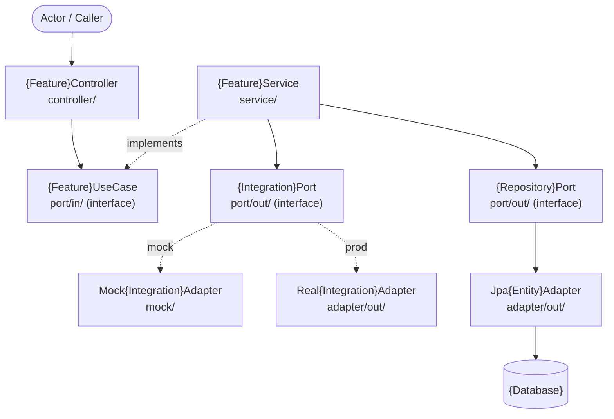

# Architecture Document
# Feature: {Feature Name}
> Version: 1.0 | Status: Draft | Date: {date} | Author: {author}

---

## References
| Source | Sections / IDs Used |
|---|---|
| srd.summary.md | {FR-NNN, NFR-NNN referenced} |
| clarify.summary.md | {resolved items applied} |
| analyze.summary.md | {risk mitigations §2, NFR impact §5 applied} |

## 1. Architecture Overview

### 1.1 Architecture Pattern
{Chosen pattern: e.g. Hexagonal / Layered / Event-Driven / CQRS}
{One paragraph — why this pattern fits this project, what constraints drove the choice}

### 1.2 System Layers
| Layer | Package Path | Responsibility |
|---|---|---|
| Controller | `controller/` | Receive request, delegate to use case, return response |
| Inbound Port | `port/in/` | Use case interface — business operations |
| Service | `service/` | Business logic implementation |
| Outbound Port | `port/out/` | Integration interface — dependency inversion |
| Mock Adapter | `mock/` | `@Profile("mock")` — test and dev implementation |
| Real Adapter | `adapter/out/` | `@Profile("prod")` — production implementation |
| Domain | `domain/` | Entities, value objects, enums |
| DTO | `dto/` | Request / response records |

## 2. Component Structure

## 3. Layer Responsibilities
| Layer | Package Path | What it owns | What it must NOT do |
|---|---|---|---|
| Controller | `controller/` | HTTP request parsing, response mapping | Business logic, DB calls |
| Inbound Port | `port/in/` | Use case contract | Implementation |
| Service | `service/` | Business rules, orchestration | Direct DB/HTTP calls |
| Outbound Port | `port/out/` | Integration contract | Implementation |
| Adapter (out) | `adapter/out/` | External system calls | Business logic |
| Domain | `domain/` | Entities, value objects | Framework dependencies |
| DTO | `dto/` | Request/response structure | Business rules |

## 4. Key Design Decisions
| ID | Decision | Rationale | Alternatives Rejected |
|---|---|---|---|
| DEC-{NNN} | {what was decided} | {why} | {what was rejected and why} |
| DEC-{NNN} | {what was decided} | {why} | {what was rejected and why} |

> **Pilot scope:** fill DEC-NNN only — ADRs are generated later by `/plan-adr` (mvp+ only).
> **MVP+ scope:** `/plan-adr` converts each HIGH-impact DEC-NNN into a full ADR-NNN record.

## 5. NFR → Architecture Decision Mapping
| NFR-NNN | Requirement | Design Constraint Applied | Decision (DEC-NNN) |
|---|---|---|---|
| NFR-{NNN} | {measurable requirement from analyze.summary.md §5} | {what it forces in the design} | DEC-{NNN} |

Every NFR from `analyze.summary.md §5` must appear here with the decision that satisfies it.

## 6. Cross-Cutting Concerns
| Concern | Approach |
|---|---|
| Authentication | {token type, validation point — from constitution} |
| Authorisation | {RBAC / scope checks — where enforced} |
| Logging | Structured JSON + correlation ID on every log line |
| Error Handling | Global exception handler + error envelope response |
| Idempotency | {approach if applicable — e.g. Idempotency-Key header + dedup table} |
| Observability | {metrics / tracing approach — e.g. Micrometer + Prometheus} |

---

## Approvals
| Role | Approver | Status | Date |
|---|---|---|---|
| Architect | | Pending | |
| Tech Lead | | Pending | |

## Version History
| Version | Date | Changed By | Summary | CHG-NNN |
|---|---|---|---|---|
| 1.0 | {date} | {author} | Initial draft | — |
