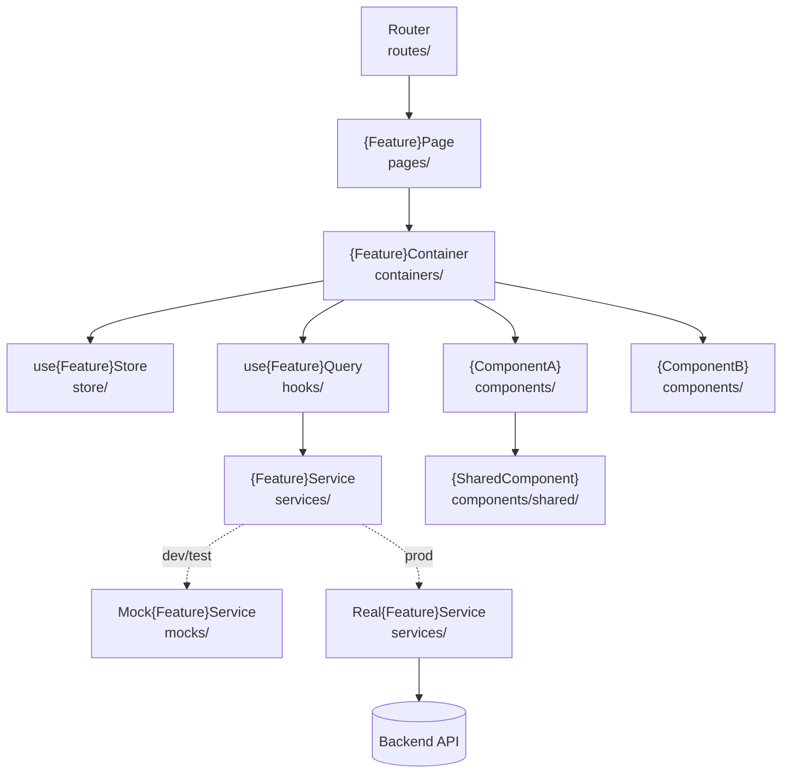

# Architecture Document
# Feature: {Feature Name}
> Version: 1.0 | Status: Draft | Date: {date: YYYY-MM-DD} | Author: {author}

---

## References
| Source | Sections / IDs Used |
|---|---|
| srd.summary.md | {FR-NNN, NFR-NNN referenced} |
| clarify.summary.md | {resolved items applied} |
| analyze.summary.md | {risk mitigations §2, NFR impact §5 applied} |

## 1. Architecture Overview

### 1.1 Architecture Pattern
{Chosen pattern: e.g. Container/Presentational / Feature-Slice / Micro-Frontend}
{One paragraph — why this pattern fits this project, state management approach, why}

### 1.2 System Layers
| Layer | Folder | Responsibility |
|---|---|---|
| Page | `pages/` | Route entry — composes containers, no logic |
| Container | `containers/` | Owns state + side-effects, delegates to hooks/services |
| Hooks/Composables | `hooks/` | Data fetching, derived state, reusable side-effect logic |
| Store | `store/` | Global state slice (Redux/Zustand/Pinia/Context) |
| Service | `services/` | API client calls + request/response transformation |
| Mock Service | `mocks/` | MSW/mock handler — dev + test |
| Presentational | `components/` | Render props/state only — zero business logic |
| Shared Components | `components/shared/` | Design-system / cross-feature reusable components |
| Routing | `routes/` | Route definitions, guards, lazy-loaded chunks |

## 2. Component Structure

## 3. Layer Responsibilities
| Layer | Folder | What it owns | What it must NOT do |
|---|---|---|---|
| Page | `pages/` | Route entry, layout composition | State, side-effects, API calls |
| Container | `containers/` | State wiring, side-effect orchestration | Rendering logic |
| Hooks | `hooks/` | Data fetching, derived state | Direct API calls, rendering |
| Store | `store/` | Global state only | Business logic, API calls |
| Service | `services/` | API calls, response mapping | State management, rendering |
| Presentational | `components/` | Rendering from props | State, API calls, business rules |

## 4. Key Design Decisions
| ID | Decision | Rationale | Alternatives Rejected |
|---|---|---|---|
| DEC-{NNN} | {what was decided} | {why} | {what was rejected and why} |
| DEC-{NNN} | {what was decided} | {why} | {what was rejected and why} |

> **Pilot scope:** fill DEC-NNN only — ADRs are generated later by `/plan-adr` (mvp+ only).
> **MVP+ scope:** `/plan-adr` converts each HIGH-impact DEC-NNN into a full ADR-NNN record.

## 5. NFR → Architecture Decision Mapping
| NFR-NNN | Requirement | Design Constraint Applied | Decision (DEC-NNN) |
|---|---|---|---|
| NFR-{NNN} | {measurable requirement from analyze.summary.md §5} | {what it forces in the design} | DEC-{NNN} |

Every NFR from `analyze.summary.md §5` must appear here with the decision that satisfies it.

## 6. Cross-Cutting Concerns
| Concern | Approach |
|---|---|
| Authentication | {token storage, route guards — from constitution} |
| Authorisation | {role-based rendering, protected routes} |
| Logging | Structured console + error tracking (Sentry / RUM) |
| Error Handling | Error boundaries + global API error handler |
| Offline/Resilience | {approach if applicable — e.g. optimistic updates, retry} |
| Observability | {performance monitoring — e.g. Web Vitals, Lighthouse CI} |

---

## Approvals
| Role | Approver | Status | Date |
|---|---|---|---|
| Architect | | Pending | |
| Tech Lead | | Pending | |

## Version History
| Version | Date | Changed By | Summary | CHG-NNN |
|---|---|---|---|---|
| 1.0 | {date: YYYY-MM-DD} | {author} | Initial draft | — |
