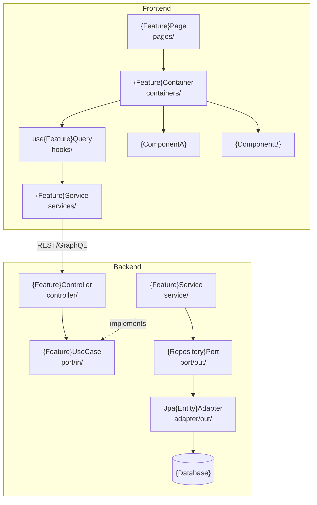

# Architecture Document
# Feature: {Feature Name}
> Version: 1.0 | Status: Draft | Date: {date} | Author: {author}

---

## References
| Source | Sections / IDs Used |
|---|---|
| srd.summary.md | {FR-NNN, NFR-NNN referenced} |
| clarify.summary.md | {resolved items applied} |
| analyze.summary.md | {risk mitigations §2, NFR impact §5 applied} |

## 1. Architecture Overview

### 1.1 Architecture Pattern
{Backend: e.g. Hexagonal / Layered / Event-Driven}
{Frontend: e.g. Container/Presentational / Feature-Slice}
{One paragraph — how both layers relate, API contract as the boundary, why this split}

### 1.2 System Layers
**Backend:**
| Layer | Package Path | Responsibility |
|---|---|---|
| Controller | `controller/` | HTTP request parsing, response mapping |
| Inbound Port | `port/in/` | Use case contract |
| Service | `service/` | Business rules, orchestration |
| Outbound Port | `port/out/` | Integration contract |
| Adapter (out) | `adapter/out/` | External system calls |
| Domain | `domain/` | Entities, value objects |

**Frontend:**
| Layer | Folder | Responsibility |
|---|---|---|
| Page | `pages/` | Route entry — composes containers |
| Container | `containers/` | State + side-effects |
| Service | `services/` | API calls to backend |
| Presentational | `components/` | Render only |

## 2. Component Structure

## 3. Layer Responsibilities
| Layer | Path | What it owns | What it must NOT do |
|---|---|---|---|
| FE Page | `pages/` | Route entry, layout | State, API calls |
| FE Container | `containers/` | State, orchestration | Rendering logic |
| FE Service | `services/` | API calls, mapping | State, rendering |
| BE Controller | `controller/` | Request/response | Business logic |
| BE Service | `service/` | Business rules | Direct DB/HTTP |
| BE Adapter | `adapter/out/` | External calls | Business logic |
| Domain | `domain/` | Entities, value objects | Framework deps |

## 4. Key Design Decisions
| ID | Decision | Rationale | Alternatives Rejected |
|---|---|---|---|
| DEC-001 | {what was decided} | {why} | {what was rejected and why} |
| DEC-002 | {what was decided} | {why} | {what was rejected and why} |

> **Pilot scope:** fill DEC-NNN only — ADRs are generated later by `/plan-adr` (mvp+ only).
> **MVP+ scope:** `/plan-adr` converts each HIGH-impact DEC-NNN into a full ADR-NNN record.

## 5. NFR → Architecture Decision Mapping
| NFR-NNN | Requirement | Design Constraint Applied | Decision (DEC-NNN) |
|---|---|---|---|
| NFR-{NNN} | {measurable requirement from analyze.summary.md §5} | {what it forces in the design} | DEC-{NNN} |

Every NFR from `analyze.summary.md §5` must appear here with the decision that satisfies it.

## 6. Cross-Cutting Concerns
| Concern | Approach |
|---|---|
| Authentication | {token type, BE validation, FE route guards} |
| Authorisation | {RBAC — BE enforcement + FE rendering guards} |
| Logging | BE: Structured JSON + correlation ID; FE: structured console + RUM |
| Error Handling | BE: Global exception handler + error envelope; FE: Error boundaries |
| API Contract | `design.md §3 API Design` is source of truth — never let layers diverge |
| Observability | {metrics / tracing — e.g. Micrometer + Web Vitals} |

---

## Approvals
| Role | Status | Date |
|---|---|---|
| Architect | Pending | |
| Tech Lead | Pending | |

## Version History
| Version | Date | Changed By | Summary | CHG-NNN |
|---|---|---|---|---|
| 1.0 | {date} | {author} | Initial draft | — |
