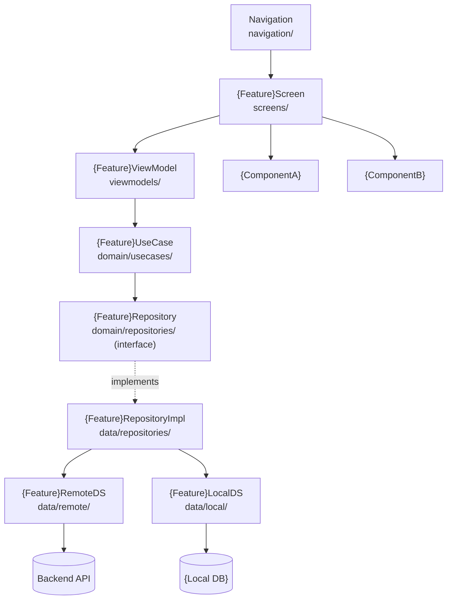

# Architecture Document
# Feature: {Feature Name}
> Version: 1.0 | Status: Draft | Date: {date: YYYY-MM-DD} | Author: {author}

---

## References
| Source | Sections / IDs Used |
|---|---|
| srd.summary.md | {FR-NNN, NFR-NNN referenced} |
| clarify.summary.md | {resolved items applied} |
| analyze.summary.md | {risk mitigations §2, NFR impact §5 applied} |

## 1. Architecture Overview

### 1.1 Architecture Pattern
{Chosen pattern: e.g. MVVM / Clean Architecture / Feature-Slice}
{One paragraph — why this pattern fits mobile, state management approach, platform constraints}

### 1.2 System Layers
| Layer | Path | Responsibility |
|---|---|---|
| Screen | `screens/` | Route/navigation entry — composes UI, no logic |
| ViewModel | `viewmodels/` | UI state, event handling, delegates to domain |
| Use Case | `domain/usecases/` | Business rules — platform-agnostic |
| Repository (interface) | `domain/repositories/` | Data contract |
| Repository (impl) | `data/repositories/` | Network + local data coordination |
| Remote Data Source | `data/remote/` | API client calls |
| Local Data Source | `data/local/` | Local DB / cache |
| Shared Components | `components/` | Reusable UI components |

## 2. Component Structure

## 3. Layer Responsibilities
| Layer | Path | What it owns | What it must NOT do |
|---|---|---|---|
| Screen | `screens/` | Navigation entry, UI composition | State, API calls, business logic |
| ViewModel | `viewmodels/` | UI state, user event handling | Direct network calls, rendering |
| Use Case | `domain/usecases/` | Business rules | Platform code, framework deps |
| Repository | `domain/repositories/` | Data contract | Implementation details |
| Remote DS | `data/remote/` | API calls, response parsing | Business logic, caching policy |
| Local DS | `data/local/` | DB/cache operations | Business logic |
| Components | `components/` | Reusable UI rendering | State, API calls |

## 4. Key Design Decisions
| ID | Decision | Rationale | Alternatives Rejected |
|---|---|---|---|
| DEC-{NNN} | {what was decided} | {why} | {what was rejected and why} |
| DEC-{NNN} | {what was decided} | {why} | {what was rejected and why} |

> **Pilot scope:** fill DEC-NNN only — ADRs are generated later by `/plan-adr` (mvp+ only).
> **MVP+ scope:** `/plan-adr` converts each HIGH-impact DEC-NNN into a full ADR-NNN record.

## 5. NFR → Architecture Decision Mapping
| NFR-NNN | Requirement | Design Constraint Applied | Decision (DEC-NNN) |
|---|---|---|---|
| NFR-{NNN} | {measurable requirement from analyze.summary.md §5} | {what it forces in the design} | DEC-{NNN} |

Every NFR from `analyze.summary.md §5` must appear here with the decision that satisfies it.

## 6. Cross-Cutting Concerns
| Concern | Approach |
|---|---|
| Authentication | {token storage — Secure Enclave / Keychain — from constitution} |
| Authorisation | {role-based screen access, feature flags} |
| Logging | {structured logging + crash reporting — e.g. Firebase Crashlytics} |
| Error Handling | {global error handler + user-facing error states in ViewModel} |
| Offline/Resilience | {offline-first strategy — local cache → sync on reconnect} |
| Observability | {performance monitoring — e.g. Firebase Performance, Xcode Instruments} |

---

## Approvals
| Role | Approver | Status | Date |
|---|---|---|---|
| Architect | | Pending | |
| Tech Lead | | Pending | |

## Version History
| Version | Date | Changed By | Summary | CHG-NNN |
|---|---|---|---|---|
| 1.0 | {date: YYYY-MM-DD} | {author} | Initial draft | — |
